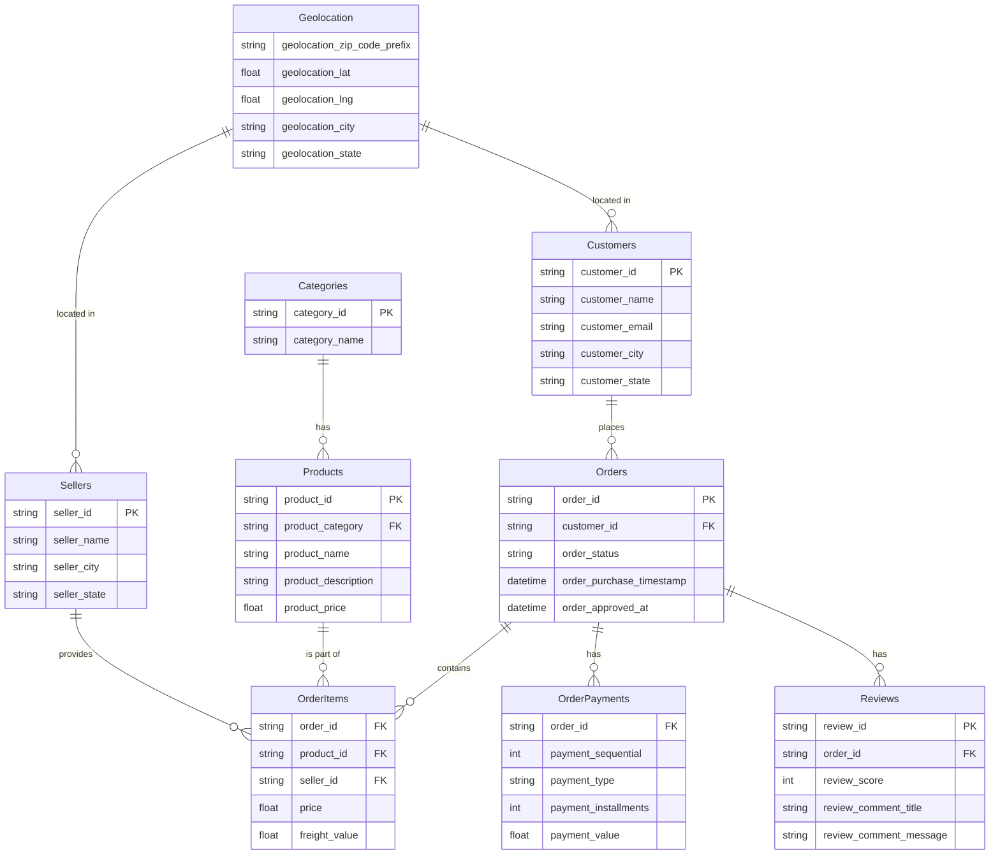
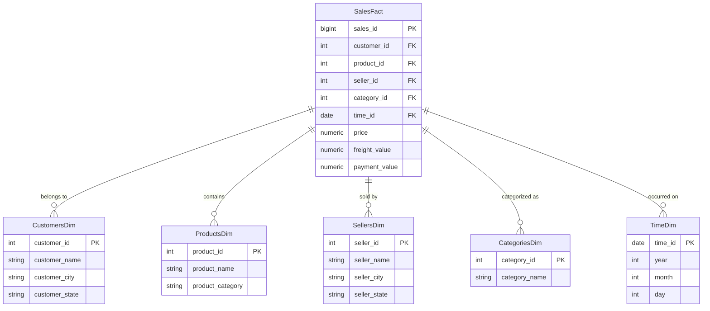

# e-comm-warehouse
A sample E-Commerce Warehouse System

# Participants
1. Anirban Sinha
2. Aditya Singh Rathore
3. Vinod Kanwar
---
---
# ER Diagram For Source Schema

## About this Dataset
### Categories.csv
* Description: This file contains information about the categories of products available in the dataset.
* Columns:
1. category_id: Unique identifier for each category.
2. category_name: Name of the product category.

### Customers.csv
* Description: This file provides details about the customers who have made purchases.
* Columns:
1. customer_id: Unique identifier for each customer.
2. customer_name: Name of the customer.
3. customer_email: Email address of the customer.
4. customer_city: City where the customer is located.
5. customer_state: State or region where the customer is located.

### Geolocation.csv
* Description: This file includes geographical information related to the sellers or customers.
* Columns:
1. geolocation_zip_code_prefix: Prefix of the zip code.
2. geolocation_lat: Latitude coordinates.
3. geolocation_lng: Longitude coordinates.
4. geolocation_city: City name.
5. geolocation_state: State name.

### Order Items.csv
* Description: This file contains details about the items included in each order.
* Columns:
1. order_id: Unique identifier for each order.
2. product_id: Unique identifier for each product.
3. seller_id: Unique identifier for each seller.
4. price: Price of the product.
5. freight_value: Freight value of the product.

### Order Payments.csv
* Description: This file provides information about the payments made for orders.
* Columns:
1. order_id: Unique identifier for each order.
2. payment_sequential: Sequential number for each payment.
3. payment_type: Type of payment used.
4. payment_installments: Number of installments for the payment.
5. payment_value: Value of the payment.

### Orders.csv
* Description: This file contains general details about the orders placed.
* Columns:
1. order_id: Unique identifier for each order.
2. customer_id: Unique identifier for each customer.
3. order_status: Status of the order (e.g., delivered, shipped, etc.).
4. order_purchase_timestamp: Timestamp for when the order was placed.
5. order_approved_at: Timestamp for when the order was approved.

### Products.csv
* Description: This file provides information about the products available for purchase.
* Columns:
1. product_id: Unique identifier for each product.
2. product_category: Category to which the product belongs.
3. product_name: Name of the product.
4. product_description: Description of the product.
5. product_price: Price of the product.

### Reviews.csv
* Description: This file includes reviews provided by customers for products.
* Columns:
1. review_id: Unique identifier for each review.
2. order_id: Unique identifier for each order.
3. review_score: Score given by the customer for the product.
4. review_comment_title: Title of the review comment.
5. review_comment_message: Message of the review comment.

### Sellers.csv
* Description: This file contains information about the sellers offering products in the dataset.
* Columns:
1. seller_id: Unique identifier for each seller.
2. seller_name: Name of the seller.
3. seller_city: City where the seller is located.
4. seller_state: State or region where the seller is located.
---
---
# ER Diagram For OLAP Schema

## Definitions
### Fact Table: 
**SalesFact**: Central table containing quantitative metrics (e.g., price, freight_value, payment_value).Foreign keys link to dimension tables.

### Dimension Tables: 
1. **CustomersDim**: Information about customers (e.g., name, city, state).
2. **ProductsDim**: Details about products (e.g., name, category).
3. **SellersDim**: Seller details (e.g., name, location).
4. **CategoriesDim**: Product categories.
5. **TimeDim**: Date-based attributes for time analysis.

### Relationships:

* Fact table connects to dimensions with FK relationships.
* This schema follows the star schema design, ideal for OLAP systems.

