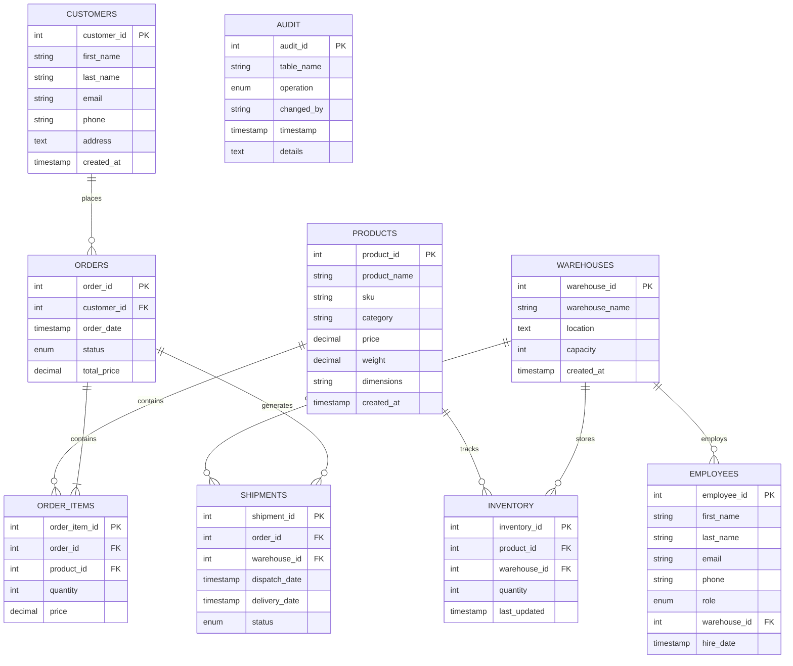

# e-comm-warehouse
A sample E-Commerce Warehouse System

# Participants
1. Anirban Sinha
2. Aditya Singh Rathore
3. Vinod Kanwar

# ER Diagram

```mermaid
erDiagram
    CUSTOMERS ||--o{ ORDERS : places
    CUSTOMERS {
        int customer_id PK
        string first_name
        string last_name
        string email
        string phone
        text address
        timestamp created_at
    }
    
    PRODUCTS ||--o{ ORDER_ITEMS : contains
    PRODUCTS ||--o{ INVENTORY : tracks
    PRODUCTS {
        int product_id PK
        string product_name
        string sku
        string category
        decimal price
        decimal weight
        string dimensions
        timestamp created_at
    }
    
    WAREHOUSES ||--o{ INVENTORY : stores
    WAREHOUSES ||--o{ EMPLOYEES : employs
    WAREHOUSES ||--o{ SHIPMENTS : dispatches
    WAREHOUSES {
        int warehouse_id PK
        string warehouse_name
        text location
        int capacity
        timestamp created_at
    }
    
    INVENTORY {
        int inventory_id PK
        int product_id FK
        int warehouse_id FK
        int quantity
        timestamp last_updated
    }
    
    ORDERS ||--|{ ORDER_ITEMS : contains
    ORDERS ||--o{ SHIPMENTS : generates
    ORDERS {
        int order_id PK
        int customer_id FK
        timestamp order_date
        enum status
        decimal total_price
    }
    
    ORDER_ITEMS {
        int order_item_id PK
        int order_id FK
        int product_id FK
        int quantity
        decimal price
    }
    
    EMPLOYEES {
        int employee_id PK
        string first_name
        string last_name
        string email
        string phone
        enum role
        int warehouse_id FK
        timestamp hire_date
    }
    
    SHIPMENTS {
        int shipment_id PK
        int order_id FK
        int warehouse_id FK
        timestamp dispatch_date
        timestamp delivery_date
        enum status
    }
    
    AUDIT {
        int audit_id PK
        string table_name
        enum operation
        string changed_by
        timestamp timestamp
        text details
    }
```